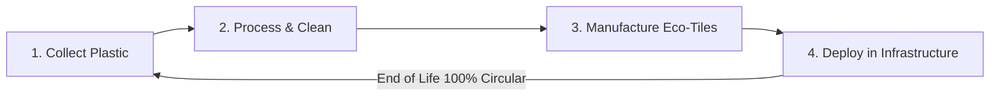

# WasteCraft — Project Overview & Context

Welcome to **WasteCraft**! This document provides a comprehensive overview of the WasteCraft project, tailored specifically to help onboarding team members, especially in **finance, budget planning, and project management**, understand the technical, financial, and ecological parameters of our business.

---

## 🏗️ 1. Project Mission & Core Business
WasteCraft is a climate-tech initiative addressing two critical issues simultaneously:
1. **India's plastic waste crisis** (rivers, landfills, streets choked with single-use plastics).
2. **Sustainable building materials shortage** (rising costs of conventional cement, wood, clay, and concrete).

### The Closed-Loop Process
We run a 4-step circular economy cycle:

---

## 📊 2. Key Product Specifications
Our flagship product is the **WasteCraft Eco-Tile / Shingle**, a premium, high-strength exterior cladding tile made of 100% recycled polymers (primarily post-consumer PVC).

| Parameter | Specification | Budget / Logistics Impact |
| :--- | :--- | :--- |
| **Dimensions** | 400mm x 304mm (Interlocking) | Fast, modular installation reduces labour costs. |
| **Unit Weight** | **1.8 kg** | **50% lighter** than traditional clay/concrete tiles. |
| **Lifespan** | 50+ Years (with Warranty) | High durability reduces long-term maintenance costs. |
| **Water Absorption** | <0.1% (Impermeable) | Excludes moisture damage and freeze-thaw cracking. |
| **Fire Rating** | Class B1 (Self-extinguishing) | Meets stringent urban safety codes. |
| **Flexural Strength** | >15 MPa | Strong load-bearing capacity under deflection. |
| **Thermal Index** | 0.18 W/m·K | High insulation reduces internal building temperatures. |

---

## 💰 3. Financial & Budgeting Value Proposition
For a **Budget Planner**, WasteCraft offers clear cost-saving vectors over conventional clay or concrete tiles:

### A. Structural Load Reductions (Truss Costs)
Because our tiles weigh only **1.8 kg** compared to Clay (3.2 kg) or Concrete (4.5 kg), using WasteCraft saves over **1,500 kg of dead weight** on a standard residential roof.
* **Budget Impact:** Architects can specify lighter, less expensive timber or steel roof support trusses, reducing framing material costs by **15% to 20%**.

### B. Zero Transit & Installation Scrap Loss
Traditional clay and concrete tiles are brittle; they typically suffer **8% to 10% breakage** during transport, loading, and installation. WasteCraft tiles are made of a tough polymer matrix and are virtually unbreakable.
* **Budget Impact:** Eliminates the need to over-order materials by 10% to cover scrap. Budget planners can calculate exactly 1:1 needs.

### C. Zero Lifecycle Maintenance Costs
Traditional wood cladding requires painting/staining every 3-5 years, and clay/concrete tiles require replacement every 25-30 years due to weathering or cracking.
* **Budget Impact:** WasteCraft tiles last **50+ years** with zero paint, sealants, or weathering replacements, cutting lifecycle maintenance budgets by **80%**.

### D. Energy Savings (Operational Costs)
Our tiles offer a low thermal conductivity of **0.18 W/m·K**.
* **Budget Impact:** This keeps building interiors cooler and reduces HVAC/cooling electricity bills by up to **38% to 42%**, providing a strong ROI selling point to clients.

### E. ESG and Subsidy Eligibility
Upcycling plastic waste (24.4 kg per $m^2$) qualifies construction projects for high-value green building certifications (e.g., LEED, GRIHA) and ESG-focused capital.
* **Budget Impact:** Unlocks potential government tax incentives, carbon offset credits, and green subsidies.

---

## 📈 4. Ecological Impact Formula
For project scoping and environmental reporting:
* **Plastic Upcycled per $m^2$ of Cladding:** **24.4 KG**
* **Approximate Bottle Equivalents:** ~1,220 single-use plastic bottles upcycled per $m^2$.
* **Embodied Carbon Offset:** **0.0366 Tonnes of $CO_2$ equivalent** per $m^2$.

---

## 💻 5. Technology & Web Application Stack
The WasteCraft web presence is built to showcase these products and track real-time project metrics.

### Frontend Tech Stack
* **Core:** React 19 (JavaScript) + Vite.
* **Styling:** Vanilla CSS (utilizing variable design tokens in `index.css`) + Tailwind CSS utility integration.
* **Animations:** Framer Motion for cinematic page transitions and Lucide React for iconography.
* **Routing:** `react-router-dom` v7.

### Site Map & Page Architecture
1. **Home Page (`/`)**: Introduces the WasteCraft concept, core stats, and the three pillars of action (Collect, Transform, Build).
2. **Solutions Page (`/solutions`)**: Deep dive into the 4-step process and environmental challenges.
3. **Projects Showcase (`/projects`)**:
   * **Social View:** A clean Instagram-like profile layout highlighting projects as visual posts.
   * **Pinboard View:** A Pinterest-style masonry grid layout allowing users to save/bookmark project inspirations.
   * **Impact Dashboard:** A dynamic calculator letting prospective clients slide to estimate weight diverted, carbon offset, and bottle equivalent based on facade square footage.
4. **Product Detail Page (`/product/:id`)**: Displays technical specifications, blueprints, and side-by-side comparison tables against traditional materials.
5. **About Page (`/about`)**: Background on founders, company culture, and the "Why WasteCraft" value proposition.
